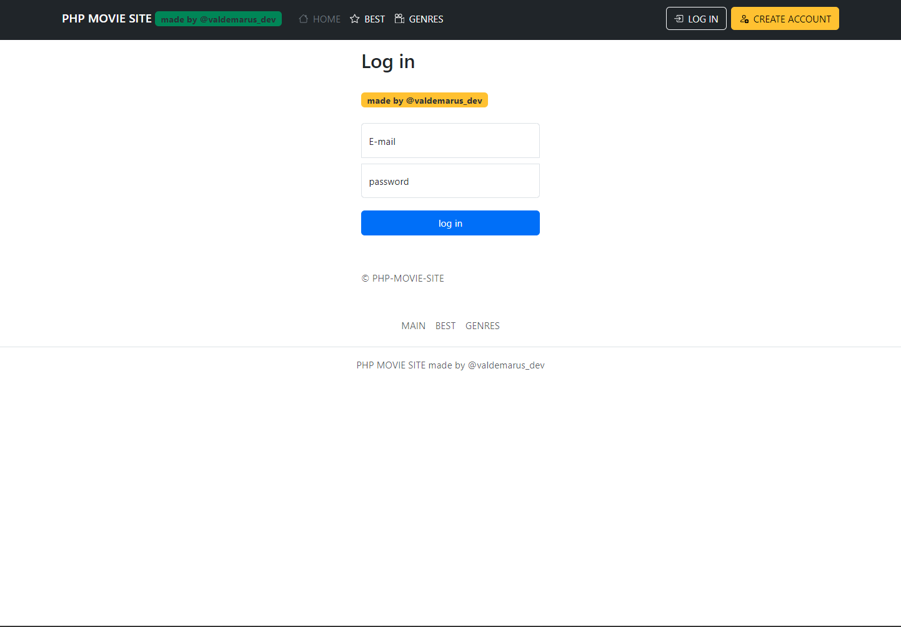

# SIMPLE PHP MOVIE SITE

## backend :
### lando environment , php 8.1 , mysql , apache
## front-end : bootstrap , js .

### get started :
    - install lando https://docs.lando.dev/install/windows.html
    - clone this repository
    - lando start
    - lando db-import lamp.sql
    - lando composer install

### project functional
    - simple authorization & registration
    - full CRUD operations for site admin
        - Create new genre, delete genre, edit name
        - Create new film ( with photo preview ) , delete film , change film genre, edit film name and etc.
    - secure routing
#### THIS PROJECT WAS WRITING adhering to the standards of object-oriented class programming ( Model, View, Controller ) . Separation of functionality into kernel logic and other application logic is created. The kernel, in turn, is independent of the view and implementation. ( As far as I know, this is correct =) ).
A few images :

